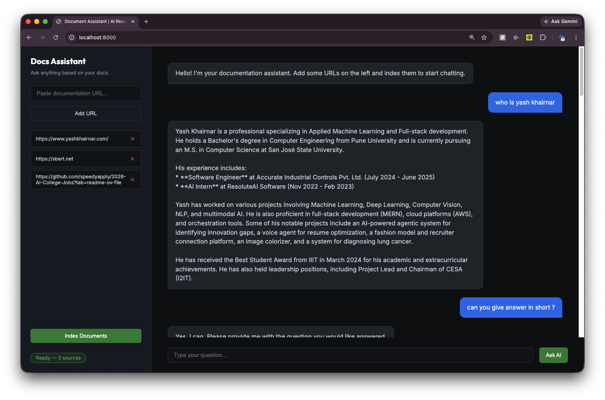

# Technical Documentation Assistant (RAG)

A professional Retrieval-Augmented Generation (RAG) application designed to provide AI-powered support based on technical documentation URLs. Users can index multiple documentation sources and chat with an assistant that retrieves context from the indexed material to provide accurate, technical answers.




## Features

- **Multi-URL Ingestion**: Index one or many documentation websites simultaneously.
- **Production-Grade Architecture**: Modular service-oriented design with a clear separation of concerns (API, Core, Services).
- **Advanced RAG Pipeline**:
  - **Ingestion**: Efficient document fetching, splitting, and vector indexing.
  - **Inference**: Conversational AI agent using LangGraph and Gemini for context-aware reasoning.
- **Interactive UI**: Modern dark-mode web interface with real-time feedback and "thinking" indicators.
- **Robust Configuration**: Centralized settings management using `pydantic-settings`.

## Project Structure

```text
DocumentAssistant/
├── app/
│   ├── api/                # API Layer (Router, Schemas)
│   ├── core/               # Core configuration & logging
│   ├── services/           # Business Logic (Embedding, Document, RAG services)
│   ├── static/             # Frontend UI (index.html)
│   └── main.py             # FastAPI App Initialization
├── run.py                  # Entry Point
├── .env                    # Environment Variables
└── requirements.txt        # Dependencies
```

## Setup & Installation

### 1. Prerequisites
- Python 3.9+
- A Google Gemini API Key

### 2. Clone and Initialize
```bash
# Clone the repository
git clone <repository-url>
cd DocumentAssistant

# Create and activate a virtual environment
python3 -m venv .venv
source .venv/bin/activate
```

### 3. Install Dependencies
```bash
pip install -r requirements.txt
```

### 4. Configuration
Create a `.env` file in the root directory and add your Google Gemini API Key:
```text
GOOGLE_API_KEY=your_api_key_here
```

## Usage

### Running the Application
Launch the server using the provided `run.py` script:
```bash
python run.py
```
The application will be available at `http://localhost:8000`.

### Workflow
1. **Index Documents**: Paste one or more documentation URLs (e.g., `https://docs.pydantic.dev/`) into the sidebar and click **Index Documents**.
2. **Wait for Ready**: The status badge will update to "Ready" once the ingestion pipeline has completed.
3. **Chat**: Ask technical questions in the chat area. The AI will look up relevant context from the indexed docs before answering.

## Tech Stack

- **Backend**: FastAPI
- **AI Orchestration**: LangChain, LangGraph
- **LLM**: Google Gemini (gemini-1.5-flash)
- **Embeddings**: Sentence-Transformers (all-MiniLM-L6-v2)
- **Vector Store**: InMemoryVectorStore
- **Frontend**: Vanilla HTML/CSS/JS (Modern Dark Mode)
